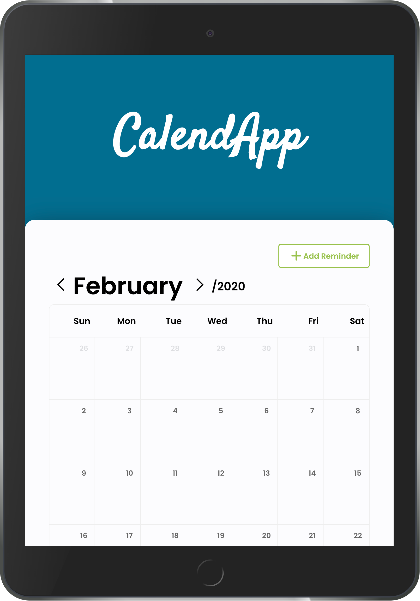

Live preview <a href="calendapplication.netlify.app">here</a>

CalendApp is a **Single Page Application** to add, view, update and delete calendar reminders!

## Technologies

- React
- Typescript
- Styled Components

## Requirements

- Node v12 or higher
- NPM or Yarn

## Setup

1. `npm install` or `yarn install`
2. `npm start` or `yarn start`

> To generate a production version, run `npm run build` or `yarn build`

## Setup Tests

1. `npm test` or `yarn test`

## Available Tests

1. ✅ **should be able to add a new reminder**
