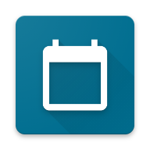

   
  <h2 style="margin-top:-10px" align="center">CalendApp</h2>
  

  CalendApp is a <b>Single Page Application</b> to add, view, update and delete calendar reminders!
  

## Preview

  

Check out the live preview <a href="https://calendapplication.netlify.app">here</a> :)

## Technologies

- React
- Typescript
- Styled Components

## Requirements

- Node v12 or higher
- NPM or Yarn

## Setup

1. `npm install` or `yarn install`
2. `npm start` or `yarn start`

> To generate a production version, run `npm run build` or `yarn build`

## Run Tests

1. `npm test` or `yarn test`

## Available Tests

1. ✅ **should be able to add a new reminder**
